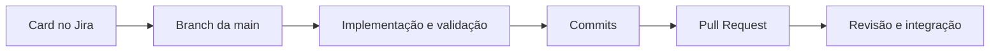

<p align="center">
  
</p>

<h1 align="center">Guia de desenvolvimento do ASTRO</h1>

<p align="center">
  Convenções compartilhadas para transformar cada card em uma entrega clara, rastreável e fácil de revisar.
</p>

Este repositório reúne as convenções de trabalho do **ASTRO**, plataforma de apoio à gestão de conformidade com Normas Regulamentadoras (NRs), treinamentos e certificados de Saúde e Segurança do Trabalho (SST).

O guia ajuda a equipe a manter o trabalho ligado ao Jira, organizar o histórico Git e dar contexto suficiente para revisão. O [perfil da organização](profile/README.md) apresenta o produto, a equipe e as tecnologias. As instruções técnicas de instalação e execução pertencem aos repositórios de cada aplicação.

## Comece por aqui

| Para... | Consulte |
| --- | --- |
| Entender o produto e os princípios da equipe | [Introdução](docs/introducao.md) |
| Nomear branches, commits e Pull Requests | [Padrões Git](docs/padroes-git.md) |
| Organizar cards, escopo e acompanhamento | [Organização do projeto](docs/organizacao-projeto.md) |
| Preencher cards e descrições de PR | [Templates](docs/templates.md) |
| Ver as convenções aplicadas na prática | [Exemplos](docs/exemplos.md) |

## Fluxo de uma alteração



Use o mesmo código do card no nome da branch, nos commits e no título do PR. A descrição do PR deve conter o link do card e um resumo das mudanças. Consulte [Padrões Git](docs/padroes-git.md) para os formatos completos.

## Regra de ouro

```text
card claro → branch focada → commits rastreáveis → PR verificável
```

Cada entrega deve responder, sem ambiguidade: **por que a mudança existe, o que foi alterado e como outra pessoa pode validá-la**.

<table>
  <tr>
    <td width="76%">
      <h3>SATH acompanha a tripulação</h3>
      <p>Nosso mascote representa uma tecnologia próxima e clara. Ele também lembra que documentação, validação e colaboração fazem parte da mesma missão.</p>
      <p><a href="profile/README.md"><strong>Conheça o ASTRO e a equipe →</strong></a></p>
    </td>
    <td width="24%" align="center">
      
    </td>
  </tr>
</table>

## Alcance deste guia

Estas convenções servem de referência para os repositórios do ASTRO. Instruções específicas de arquitetura, testes, ambientes e entrega devem ser documentadas no próprio repositório que as utiliza. Quando houver uma regra local diferente, registre a exceção ali e mantenha os exemplos deste guia coerentes com a prática da equipe.
