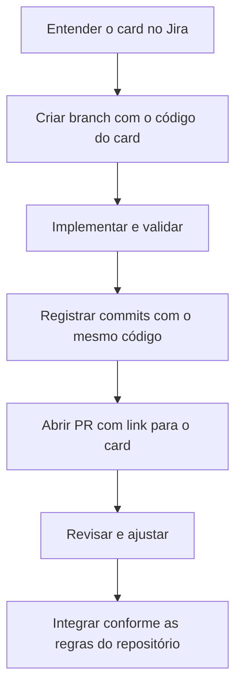

# Exemplos práticos

Os códigos de Jira abaixo são **ilustrativos**. Ao executar uma tarefa, use o identificador do card real. Os exemplos mostram o formato dos registros; funcionalidades e critérios dependem do card aprovado pela equipe.

## Nova funcionalidade

Exemplo: permitir o acompanhamento de certificados próximos do vencimento.

```text
Branch: feat/KNBN-0123-listar-certificados-a-vencer
Commit: feat(KNBN-0123): listar certificados próximos do vencimento
PR: [KNBN-0123] feat: Listagem de certificados a vencer
```

No PR, descreva a regra de prazo implementada conforme o card, a origem dos dados e como validar a lista. Anexe uma evidência com dados fictícios se houver alteração visual.

## Correção

Exemplo: corrigir a exibição de uma data de validade.

```text
Branch: fix/KNBN-0124-corrigir-data-validade-certificado
Commit: fix(KNBN-0124): corrigir exibição da validade do certificado
PR: [KNBN-0124] fix: Correção da validade do certificado
```

Registre no card o valor observado, o valor esperado e os passos para reproduzir. No PR, explique o caso corrigido e a verificação feita.

## Documentação

Exemplo: atualizar as instruções de uma API do ASTRO.

```text
Branch: docs/KNBN-0125-atualizar-guia-da-api
Commit: docs(KNBN-0125): atualizar instruções da API
PR: [KNBN-0125] docs: Atualização do guia da API
```

Indique a documentação alterada e confira se os comandos e links publicados funcionam.

## Sequência completa



Consulte [Padrões Git](padroes-git.md) para a sintaxe e [Templates](templates.md) para o conteúdo de card e PR.
