  

  <a href="#por-que-o-astro">O ASTRO</a> ·
  <a href="#o-que-estamos-construindo">Plataforma</a> ·
  <a href="#conheça-o-sath">Mascote</a> ·
  <a href="#tecnologias">Tecnologias</a> ·
  <a href="#equipe">Equipe</a> ·
  <a href="https://github.com/Astro-Inter/.github/blob/main/README.md">Guia de desenvolvimento</a>

  <strong>Conformidade em órbita.</strong> 
  NRs, treinamentos, certificados e pendências em uma experiência simples para equipes de RH e SST.

  

## Por que o ASTRO

Informações de conformidade costumam ficar espalhadas por planilhas, documentos e sistemas diferentes. Isso dificulta acompanhar prazos, identificar pendências e manter uma visão confiável das obrigações.

O **ASTRO** nasce para reunir esse contexto em um único lugar. A plataforma está sendo construída para transformar rotinas complexas de **Saúde e Segurança do Trabalho** em jornadas mais claras, visuais e fáceis de acompanhar.

## O que estamos construindo

| Frente | Como o ASTRO ajuda |
| --- | --- |
| **NRs** | Organiza as exigências aplicáveis e facilita seu acompanhamento. |
| **Treinamentos** | Reúne capacitações obrigatórias, reciclagens e seus prazos. |
| **Certificados** | Centraliza registros e acompanha períodos de validade. |
| **Pendências** | Destaca o que precisa de atenção para orientar a próxima ação. |
| **Apoio inteligente** | Facilita consultas e análises das informações com IA. |

> O ASTRO apoia a organização e a análise das informações. A avaliação das obrigações legais continua sob responsabilidade dos profissionais da área.

## Conheça o SATH

<table>
  <tr>
    <td width="42%" align="center">
      
    </td>
    <td width="58%">
      <h3>Seu copiloto na jornada de conformidade</h3>
      
O <strong>SATH</strong> traduz a personalidade do ASTRO: tecnologia próxima, orientação clara e curiosidade para explorar informações complexas.

    </td>
  </tr>
</table>

## Tecnologias

O projeto combina diferentes tecnologias conforme a necessidade de cada componente. As instruções de instalação e as decisões de arquitetura ficam em seus respectivos repositórios.

| Área | Tecnologias utilizadas |
| --- | --- |
| Web | React, TypeScript, JavaScript, HTML e CSS |
| Serviços | Python, FastAPI, Java e Spring Boot |
| Dados | PostgreSQL, MongoDB, Redis e Neo4j |
| Inteligência artificial | Gemini, Groq, LangChain, LangGraph e LangSmith |
| Mobile | Android |
| Desenvolvimento e gestão | Docker, GitHub, Figma e Jira |

## Equipe

<table align="center">
  <tr>
    <td align="center" width="50%">
      <a href="https://github.com/Lipe-to"> <strong>Felipe Battalhini Boregio</strong></a> 
      Back-end · @Lipe-to
    </td>
    <td align="center" width="50%">
      <a href="https://github.com/rosamaduda"> <strong>Maria Eduarda Araujo Gonçalves Rosa</strong></a> 
      Back-end · @rosamaduda
    </td>
  </tr>
  <tr>
    <td align="center">
      <a href="https://github.com/IgorQuinto5"> <strong>Igor Quinto</strong></a> 
      Front-end · @IgorQuinto5
    </td>
    <td align="center">
      <a href="https://github.com/Taina14m"> <strong>Tainá Dias Martinelli</strong></a> 
      Front-end · @Taina14m
    </td>
  </tr>
  <tr>
    <td align="center">
      <a href="https://github.com/lucaslimaoliveira"> <strong>Lucas Lima De Oliveira</strong></a> 
      Dados · @lucaslimaoliveira
    </td>
    <td align="center">
      <a href="https://github.com/LuizaDeVicente"> <strong>Luiza Cursino De Vicente</strong></a> 
      Dados · @LuizaDeVicente
    </td>
  </tr>
</table>

## Desenvolvimento

Quer contribuir? O [guia de desenvolvimento](https://github.com/Astro-Inter/.github/blob/main/README.md) reúne a organização do trabalho no Jira, os padrões de Git e os modelos usados nas entregas. Para instalar ou contribuir em um componente, consulte também o README do repositório correspondente.

## Licença

O projeto está em desenvolvimento. A licença ainda não foi definida.
